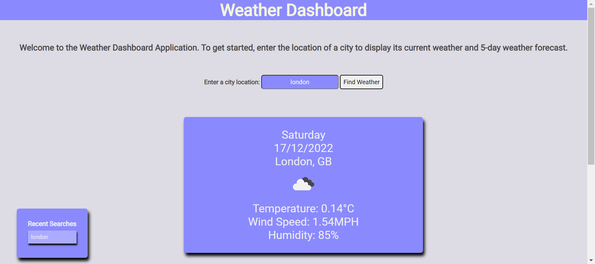
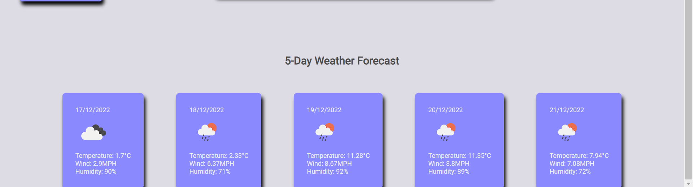

# Weather-Dashboard

## User Story

```
AS A traveler
I WANT to see the weather outlook for multiple cities
SO THAT I can plan a trip accordingly
```

## Acceptance Criteria

```
GIVEN a weather dashboard with form inputs
WHEN I search for a city
THEN I am presented with current and future conditions for that city and that city is added to the search history
WHEN I view current weather conditions for that city
THEN I am presented with the city name, the date, an icon representation of weather conditions, the temperature, the humidity, and the wind speed
WHEN I view future weather conditions for that city
THEN I am presented with a 5-day forecast that displays the date, an icon representation of weather conditions, the temperature, the wind speed, and the humidity
WHEN I click on a city in the search history
THEN I am again presented with current and future conditions for that city
```

## Criteria Met

When a city is searched in the input box, then the current weather and 5-day future weather forecast for that city is displayed on screen. The city name, the date, an icon representation of weather conditions, the temperature, the humidity, and the wind speed are all displayed for the current day. The 5 day weather forecast displays the same information. The chosen location is added to the recent searches section, where the location can be clicked from here and the current and future conditions for that city is show.

## Problems Encountered

The function to find the latitude and longitude of the searched location was not working as the parameters defined in this function were incorrect. Once the right parameters were used, the weather conditions were retrieved successfully. 

## Future Work

The application is not currently responsive, therefore media queries can be added in the future to allow responsive design to take place on all devices.

## Screenshot



## Deployed Application Link